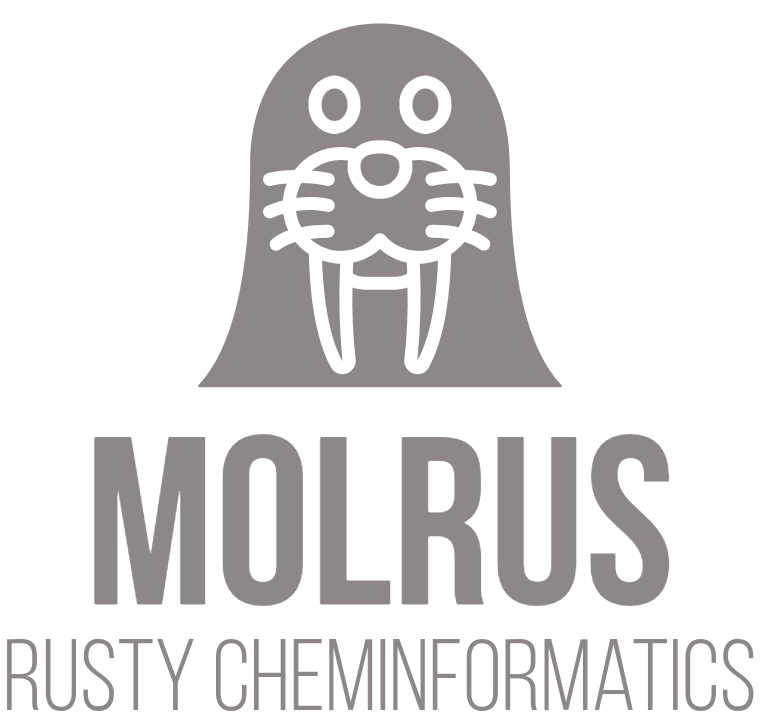

# MOLRUS

MOLRUS is an open-source library for Cheminformatics written in Rust. The plans for the future are to support all these.

- [ ] Molecule and reaction valence bond representation.
- [ ] Read and write file formats: 
        - [ ] SMILES
        - [ ] SDF
        - [ ] InChI
        - [ ] Mol2
- [ ] Efficient molecule processing algorithms: Ring Finding, Kekulisation, Aromaticity.
- [ ] Depiction
- [ ] Substructure and SMARTS pattern searching.
- [ ] ECFP, Daylight, MACCS, and other fingerprint methods for similarity searching.
- [ ] WASM Builds and Python Bindings
- [ ] Better documentation

### Why another bloody cheminformatics library

First off, chemcore exists I know. I love it. You can almost call this a fork of chemcore, but also I have changed bits and pieces and deviated from the original chemcore library which makes it less chemcore and more molrus. But, but, but... there's a big giant library called RDKit and another called CDK and various others. RDKit even has good Python bindings! CDK is written in Java and RDKit uses Boost. Jokes aside, I wrote this library to learn Rust and cheminformaticsy cheminformatics. Yes, I know I could have chosen a way better language than Rust but fighting with the borrow-checker gives me joy and hopefully I can write "safer" code. 

### PR/Contributing?

If you spot problems, which I am confident you will or just want to add more functionalities listed above please feel free to do a PR. Just small things.

- I have tried to keep the code fairly dependency free. Please try to keep that in mind. Why? Because libraries die. 
- I tend to avoid smart pointers so Arc, RefRc is a bit out of line. I just don't like them having worked with them in RDKit. Yes, I know this is Rust but still.
- Upon download, `cargo build` should do enough to build the codebase. And then the usual stuff you do while doing a PR. Fork the library, make changes and merge into the main on this repo.

### What a stupid name

The explanation is even more daft. It's a combination of walrus and molecules.